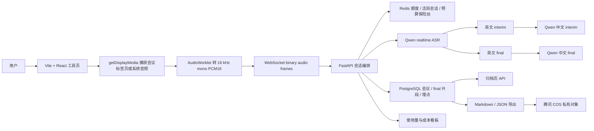
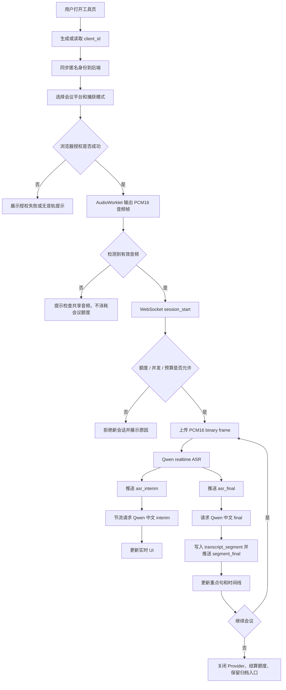

# Meeting MVP 产品需求文档

## 1. 需求背景

### 1.1 背景

许多中国职场用户需要参加英语线上会议。真实会议里，语速、口音、专业术语、多人轮流发言和上下文跳转都会显著增加理解成本。用户需要一个打开网页即可使用的效率工具，在不安装浏览器插件或桌面客户端的前提下，实时理解英语会议，并在会后获得完整、可追溯的双语记录。

| 用户画像 | 典型背景 | 主要痛点 | 使用场景 | 成功结果 |
|---|---|---|---|---|
| 英语会议参与者 | 中国职场中的产品、研发、运营、项目成员，需要参加跨境或外企英语会议。 | 听不完整、跟不上节奏、无法快速理解业务含义。 | 会议开始前打开工具页，捕获 Google Meet、Teams Web、Zoom Web 或腾讯会议网页版音频，实时阅读英文原文和中文翻译。 | 会议中持续理解讨论内容，关键观点不漏听，会后可回看对应原文。 |
| 会议记录者 / 项目负责人 | 需要负责会后复盘、同步结论或整理项目背景。 | 会议中难以同时听、理解和记录，会后缺少可追溯材料。 | 会议结束后查看双语归档，搜索关键片段，复制或导出 Markdown / JSON。 | 能基于完整片段整理纪要、任务和背景，不依赖模糊记忆。 |
| 跨境协作业务人员 | 销售、客服、解决方案或客户成功人员，需要和英语客户或海外团队沟通。 | 更关注中文表达能否快速读懂，而不是逐词硬翻。 | 实时查看更适合中国职场阅读的中文 final，并通过重点句把握客户需求或风险。 | 会议中及时跟进问题，会后可复盘客户原话和中文理解。 |
| MVP 测试 / 运营观察者 | 产品负责人或开发者，需要判断第一版是否值得继续迭代。 | 不清楚用户卡在哪一步、质量是否达标、成本是否失控。 | 查看首次使用漏斗、会议质量漏斗、价值验证漏斗和成本指标。 | 能判断核心价值是否成立，并定位改造重点。 |

### 1.2 产品定位

Meeting MVP 是一个免登录网页会议效率工具。用户打开工具页，授权捕获正在进行的网页会议音频，系统实时生成英文转写、中文临时理解、中文正式翻译、重点句和会议时间线，并在会后生成完整双语归档。

第一版以高质量英语会议理解为核心，不做泛用字幕平台。中文翻译目标是语义准确、自然、适合中国职场快速阅读。系统默认不保存原始会议音频，只保存正式 final 文本档案、导出文件和安全埋点元数据。

### 1.3 需求价值

- 降低英语会议实时理解成本。
- 保留英文原文和中文翻译的逐段对应关系，降低误解。
- 会后支持搜索、复制、重点句筛选、时间线定位和 Markdown / JSON 导出。
- 通过免登录匿名额度、预算保险丝和使用量看板控制测试成本。
- 为后续登录、邀请码、付费额度、团队版、浏览器插件或桌面客户端提供验证数据。

## 2. 第一版目标

第一版面向 10 到 50 名测试用户，目标是跑通从会议实时理解到会后双语归档的闭环。

核心目标：

- 支持 Windows Chrome / Edge。
- 重点支持 Google Meet、Microsoft Teams Web、Zoom Web、腾讯会议网页版。
- 支持标签页音频捕获；标签页音频不可用时支持系统音频降级。
- 实时输出英文 interim、英文 final、中文 interim、中文 final。
- 使用四区 UI 呈现英文原文区、中文翻译区、当前重点句区和会议时间线区。
- 会后生成以原文归档为核心的双语会议记录。
- 匿名用户免登录使用，并受每日 40 分钟、单场 30 分钟、同一匿名用户 1 个活跃会议限制。
- 支持 Markdown / JSON 导出，导出文件保存到腾讯 COS 私有对象，并由后端生成短期签名 URL。
- 提供使用量与成本看板，用于观察会议数、有效会议、活跃匿名用户、ASR 分钟、Qwen 请求、估算 token、导出、错误、漏斗、腾讯会议成功率和估算成本。

## 3. 整体设计

### 3.1 产品与技术总览

第一版采用静态前端 + FastAPI 后端 + PostgreSQL + Redis + Caddy 的单机部署架构。云服务器负责会话编排、存储、额度、Provider 调用、导出和 UI 推送，不自建重型 ASR 推理。



### 3.2 实时会议主流程



### 3.3 分层边界

前端层：

- 负责匿名 `client_id` 生成与本地持久化。
- 负责音频捕获、音频前处理、静音提示、WebSocket client、实时工作台、归档页和管理看板页面。
- 只能读取 `VITE_*` 公开配置，不得包含 Provider、数据库、Redis、COS 或管理口令密钥。

后端编排层：

- 负责匿名用户初始化、WebSocket 会话、额度、预算、Provider 调用、归档、导出、埋点、管理看板和错误处理。
- 所有密钥只通过后端安全环境变量读取。
- 所有公开 API 都不返回密钥、原始音频、明文 IP 或明文 User-Agent。

Provider 层：

- 英文实时转写主路径：阿里云百炼 `qwen3-asr-flash-realtime` realtime WebSocket。
- 中文 interim 主路径：阿里云百炼 Qwen OpenAI-compatible `/chat/completions`。
- 中文 final 主路径：阿里云百炼 Qwen `qwen3.6-max-preview`。
- OpenAI STT 仅作为候选配置和质量对比方向，不进入当前实时会议主链路。
- Google STT 不作为第一版生产主路径。

数据层：

- PostgreSQL 保存匿名用户、会议、final 片段、usage event 和导出文件。
- Redis 保存每日额度、活跃会话、预算保险丝和后台补译短期状态。
- 腾讯 COS 保存 Markdown / JSON 导出文件。
- 会议归档和 COS 导出默认保留 30 天。

## 4. 核心概念

| 名词 | 定义 |
|---|---|
| 匿名用户 | 未登录用户，通过浏览器本地 `client_id` 加服务端 IP hash、User-Agent hash 做弱识别。 |
| `client_id` | 前端首次访问生成并保存在浏览器本地的匿名用户标识。 |
| 标签页音频 | 浏览器通过 `getDisplayMedia` 捕获指定会议网页标签页时附带的音频。 |
| 系统音频 | 浏览器捕获整个屏幕或系统声音时获得的音频，可能包含非会议声音。 |
| interim | 临时结果，可替换，不进入正式归档。 |
| final | 稳定确认结果，进入正式归档或正式片段处理。 |
| 中文 final | Qwen 基于英文 final 和最近上下文生成的正式中文翻译。 |
| `archive_token` | 会后归档访问令牌；服务端只保存 hash，明文 token 只返回给前端一次并用于归档链接。 |
| 预算保险丝 | 当全站月度估算成本达到阈值时，拒绝新会议以控制成本。 |
| Provider 开关 | 通过后端环境变量控制 Qwen ASR、Qwen interim、Qwen final 等服务状态。 |

## 5. 功能清单

| 编号 | 功能 | 优先级 | 产品要求 |
|---|---|---|---|
| F01 | 匿名用户初始化 | M1-A | 首次访问生成 `client_id`，后端建立匿名额度身份。 |
| F02 | 额度与预算校验 | M1-A | 检查每日 40 分钟、单场 30 分钟、并发 1 场和全站预算保险丝。 |
| F03 | 会议音频捕获 | M1-A | 捕获会议标签页音频，必要时使用系统音频降级。 |
| F04 | 音频前处理 | M1-A | 浏览器输出 16 kHz mono PCM16，并过滤静音帧。 |
| F05 | WebSocket 会话编排 | M1-A | 建立、恢复、保持、关闭实时会议会话。 |
| F06 | 英文实时转写 | M1-A | 接入 Qwen realtime ASR，输出英文 interim/final。 |
| F07 | 中文 interim | M1-A | 对节流后的英文 interim 生成中文临时理解。 |
| F08 | 中文 final | M1-A | 对英文 final 生成正式中文翻译并归档。 |
| F09 | 四区实时 UI | M1-A | 展示英文原文、中文翻译、当前重点句、会议时间线。 |
| F10 | 会后基础双语归档 | M1-A | 通过 `session_id + archive_token` 查看 final 片段。 |
| F11 | 搜索与复制 | M2 | 在归档页搜索英文/中文/时间戳并复制片段。 |
| F12 | Markdown / JSON 导出 | M2 | 生成导出文件，上传 COS，返回短期签名 URL。 |
| F13 | final 翻译重试 | M1-B | final 翻译失败片段进入后台补译流程，归档页展示状态。 |
| F14 | 使用量与成本看板 | M1-B | 管理员查看用量、漏斗、质量、错误和估算成本。 |
| F15 | Provider 开关 | M1-B | 支持 Qwen ASR/interim/final 开关和状态展示。 |
| F16 | 异常与降级提示 | M1-A | 捕获、无音频、额度、Provider、导出等错误给出可执行提示。 |
| F17 | 当前重点句增强 | M1-B | 自动识别重点句，归档页支持人工标记或取消。 |
| F18 | 会议时间线增强 | M1-B | 展示 final、重点句、导出、异常节点，并支持筛选和跳转。 |

## 6. 详细功能要求

### F01 匿名用户初始化

- 前端首次访问生成 UUID `client_id` 并写入浏览器本地存储。
- 后端 `POST /api/anonymous-clients` upsert 匿名用户。
- 后端保存 IP hash 和 User-Agent hash，不保存明文 IP 或明文 User-Agent。
- 返回 `daily_free_seconds`、`remaining_seconds_today` 和 `is_new`。

### F02 额度与预算校验

- 每个匿名用户每日免费额度：2400 秒。
- 单场会议最长：1800 秒。
- 同一匿名用户最多 1 个活跃会议。
- 全站月度预算：500 RMB；预算保险丝阈值：400 RMB。
- 拒绝优先级：预算保险丝 > 活跃会话上限 > 每日额度耗尽 > 单场时长上限。
- 没有检测到有效音频前，不结算会议时长；会话关闭时按 active 后的有效时长结算。

### F03 会议音频捕获

- 前端使用 `getDisplayMedia` 捕获会议标签页或系统音频。
- 用户可选择会议平台：Google Meet、Teams Web、Zoom Web、腾讯会议 Web、unknown。
- 用户可选择捕获模式：`tab_audio` 或 `system_audio`。
- 标签页音频失败或无音轨时，引导用户切换系统音频。
- 用户拒绝授权时，不创建正式会议，不消耗额度。

### F04 音频前处理

- 使用 Web Audio API / AudioWorklet 输出 16 kHz、单声道、PCM16。
- WebSocket 音频帧使用 binary frame，不使用 JSON 承载音频。
- 静音帧不上传；持续静音时展示检查共享音频提示。
- 前端保留音频状态、电平、处理状态和错误提示。

### F05 WebSocket 会话编排

- `session_start` 创建会话，返回 `session_started`。
- 首个有效音频帧将会话从 `pending_audio` 转为 `active`。
- `heartbeat` 用于连接保活。
- `session_stop` 主动关闭会议并触发额度结算。
- 浏览器断线后，前端可在恢复窗口内发送 `session_resume`，使用同一 `client_id + session_id + archive_token` 恢复同一业务 session；断线期间音频不补传。
- 关闭会话时释放 Redis active session，保留已经归档的 final 片段。

### F06 英文实时转写

- 生产主路径使用 Qwen realtime ASR。
- 后端将浏览器 PCM16 binary frame 转发到 Qwen realtime WebSocket。
- 后端向前端推送 `asr_interim` 和 `asr_final`。
- `asr_final` 先用于英文原文区展示，再进入中文 final 处理。
- Qwen ASR 关闭或不可用时，拒绝新实时会议并提示服务状态。

### F07 中文 interim

- 对节流后的英文 interim 请求 Qwen 文本模型。
- 默认最小请求间隔为 1.5 秒。
- 空文本、重复文本或请求中已有更新文本时跳过或合并。
- 中文 interim 只用于实时理解，不写入正式归档。
- interim 失败只发送 warning，不影响英文 ASR 或中文 final。

### F08 中文 final

- 英文 final 出现后，后端调用 Qwen `qwen3.6-max-preview` 生成中文 final。
- 请求携带最近 5 个成功双语 final 片段作为上下文。
- 成功时写入 `transcript_segment(translation_status=completed)` 并推送 `segment_final`。
- 失败时保存英文 final、空中文 final、`translation_status=failed`，发送 warning，并进入后台补译流程。
- Qwen final 关闭时，英文 final 仍归档为待补译片段。

### F09 四区实时 UI

实时会议页第一屏就是工作台，不做营销落地页。页面至少包含：

- 英文原文区：展示英文 interim 和 final。
- 中文翻译区：展示中文 interim 和中文 final。
- 当前重点句区：展示当前识别出的重点句。
- 会议时间线区：展示 final、重点句、导出、异常等事件。

四区只消费明确的 WebSocket 消息，不从 final 文本自行派生未定义状态。任一区域更新失败不应破坏其他区域继续更新。

### F10 会后基础双语归档

- 用户通过 `archive_url` 打开归档页。
- 归档访问固定使用 `session_id + archive_token`。
- 服务端校验 token hash，过期或错误时拒绝访问。
- 归档页按 sequence 展示英文 final、中文 final、时间戳、翻译状态、重点句状态和结束原因。
- 归档页展示补译状态并自动轮询仍在补译中的片段。

### F11 搜索与复制

- 归档页支持按英文、中文和时间戳搜索。
- 无结果时展示空状态。
- 复制片段时包含时间、英文原文和中文翻译。
- 搜索和复制只上报安全元数据，不上报查询原文或完整文本。

### F12 Markdown / JSON 导出

- 归档页提供 Markdown 和 JSON 导出按钮。
- 空归档禁用导出或返回明确错误。
- 后端生成文件后上传腾讯 COS 私有对象。
- 后端写入 `export_file` 并返回短期签名下载 URL。
- 导出失败时记录 `export_failed` 并展示重试提示。

### F13 final 翻译重试

- failed/retrying 片段由 Redis scheduled set 和 per-segment lock 调度后台补译。
- 后台 worker 复用 Qwen final provider。
- 补译成功后更新中文 final 和 `translation_status=completed`。
- 补译失败时记录尝试次数和是否耗尽重试。
- 归档 API 返回 `translation_retry_attempts` 和 `translation_retry_exhausted`。

### F14 使用量与成本看板

- 管理页路径为 `/admin/usage-dashboard`。
- 后端 API 为 `GET /api/admin/usage-dashboard?days=...`，`days` 范围为 1 到 90。
- API 必须使用 `Authorization: Bearer <DASHBOARD_ADMIN_TOKEN>`。
- 未配置管理口令返回 503；缺失或错误口令返回 401。
- 前端口令只保存在 React state，不写入 URL、localStorage、sessionStorage 或日志。
- 看板展示 7/30/90 天切换、核心指标、每日趋势、首次使用漏斗、会议质量漏斗、价值验证漏斗、错误质量和成本预算。

### F15 Provider 开关

- 后端通过环境变量控制：
  - `QWEN_ASR_ENABLED`
  - `QWEN_INTERIM_ENABLED`
  - `QWEN_FINAL_ENABLED`
- `session_started` 返回 `provider_status`，包括：
  - `qwen_realtime_asr`
  - `qwen_interim_translation`
  - `qwen_final_translation`
- Provider 状态值为 `enabled`、`disabled`、`local_mock`、`unconfigured`。
- interim 关闭时，英文转写和中文 final 继续工作。
- final 关闭时，英文 final 仍归档，并进入待补译状态。

### F16 异常与降级提示

- 捕获失败、无音轨、静音、额度不足、预算保险丝、Provider warning/error、WebSocket 关闭、导出失败都必须有用户可理解提示。
- 可恢复问题使用 `warning`；不可继续问题使用 `error` 和 `session_closed`。
- 错误时停止本地音频资源，但保留已收到 final、归档入口和 session id。

### F17 当前重点句增强

- 后端用规则识别行动项、决策、截止时间、风险、预算、负责人、确认、上线等重点句。
- 命中重点句时写入 `transcript_segment.is_key_sentence` 并推送 `key_sentence_update`。
- 归档页支持“只看重点句”筛选。
- 归档页支持人工标记或取消重点句。

### F18 会议时间线增强

- 时间线节点类型包括 `segment_final`、`key_sentence`、`export_created`、`exception`。
- 实时页和归档页都支持时间线筛选。
- 点击有关联 segment 的时间线节点时定位到对应片段。

## 7. 接口与协议

### 7.1 REST API

| 方法 | 路径 | 鉴权 | 用途 |
|---|---|---|---|
| `GET` | `/health` | 无 | 后端健康检查。 |
| `POST` | `/api/anonymous-clients` | 无 | 初始化或同步匿名用户。 |
| `GET` | `/api/archives/{session_id}?token=...` | `archive_token` | 查看会后归档。 |
| `POST` | `/api/archives/{session_id}/events?token=...` | `archive_token` | 上报归档搜索/复制安全事件。 |
| `PATCH` | `/api/archives/{session_id}/segments/{segment_id}/key-sentence?token=...` | `archive_token` | 标记或取消重点句。 |
| `POST` | `/api/archives/{session_id}/exports?token=...` | `archive_token` | 创建 Markdown / JSON 导出。 |
| `GET` | `/api/admin/usage-dashboard?days=30` | Bearer 管理口令 | 查看使用量与成本看板。 |

### 7.2 WebSocket Client Messages

| 消息 | 承载 | 关键字段 |
|---|---|---|
| `session_start` | JSON | `client_id`、`capture_mode`、`source_platform`、`audio_format`。 |
| `session_resume` | JSON | `client_id`、`session_id`、`archive_token`、`audio_format`。 |
| `heartbeat` | JSON | `session_id`。 |
| `session_stop` | JSON | `session_id`。 |
| `audio_chunk` | binary | 16 kHz mono PCM16 音频帧。 |

`audio_format` 固定为：

```json
{
  "sample_rate_hz": 16000,
  "channels": 1,
  "encoding": "pcm16"
}
```

### 7.3 WebSocket Server Messages

| 消息 | 关键字段 | 用途 |
|---|---|---|
| `session_started` | `session_id`、`archive_token`、`archive_url`、`provider_status`、`remaining_seconds_today` | 会话创建成功。 |
| `session_resumed` | `session_id`、`archive_url`、`remaining_seconds_today` | 会话恢复成功。 |
| `quota_update` | `remaining_seconds_today` | 推送剩余额度。 |
| `audio_status` | `has_audio`、`level` | 推送音频检测状态。 |
| `asr_interim` | `text` | 推送英文临时转写。 |
| `asr_final` | `sequence`、`start_ms`、`end_ms`、`text`、`confidence` | 推送英文稳定转写。 |
| `translation_interim` | `text` | 推送中文临时理解。 |
| `segment_final` | `segment_id`、`sequence`、`start_ms`、`end_ms`、`english_text_final`、`chinese_text_final` | 推送已归档双语 final。 |
| `key_sentence_update` | `text` | 推送当前重点句。 |
| `timeline_update` | `items` | 推送时间线节点列表。 |
| `warning` | `code`、`message` | 可恢复问题。 |
| `error` | `code`、`message` | 不可继续问题。 |
| `session_closed` | `reason` | 会话关闭原因。 |

## 8. 数据模型

### 8.1 `anonymous_client`

| 字段 | 类型 | 定义 |
|---|---|---|
| `client_id` | string | 匿名用户唯一标识。 |
| `first_seen_at` | timestamptz | 首次访问时间。 |
| `last_seen_at` | timestamptz | 最近访问时间。 |
| `daily_minutes_used` | int | 兼容字段；实时额度以 Redis 秒级计数为准。 |
| `created_ip_hash` | string | 首次 IP hash。 |
| `user_agent_hash` | string | User-Agent hash。 |

### 8.2 `meeting_session`

| 字段 | 类型 | 定义 |
|---|---|---|
| `id` | uuid | 会议 session id。 |
| `client_id` | string | 匿名用户 id。 |
| `title` | string/null | 会议标题预留字段。 |
| `source_platform` | enum | `google_meet`、`teams_web`、`zoom_web`、`tencent_meeting_web`、`unknown`。 |
| `capture_mode` | enum | `tab_audio` 或 `system_audio`。 |
| `started_at` | timestamptz/null | 有效音频开始后的会议开始时间。 |
| `ended_at` | timestamptz/null | 会话结束时间。 |
| `duration_seconds` | int | 会话有效时长。 |
| `status` | enum | `pending_audio`、`active`、`ended`、`quota_stopped`、`error`。 |
| `quota_seconds_consumed` | int | 本场实际消耗额度秒数。 |
| `archive_token_hash` | string | 归档 token hash。 |
| `retention_expires_at` | timestamptz | 归档保留截止时间。 |

### 8.3 `transcript_segment`

| 字段 | 类型 | 定义 |
|---|---|---|
| `id` | uuid | 片段 id。 |
| `session_id` | uuid | 所属会议。 |
| `sequence` | int | 片段顺序，同一 session 内唯一。 |
| `start_ms` | int | 片段开始毫秒。 |
| `end_ms` | int | 片段结束毫秒。 |
| `english_text_final` | text | 英文 final。 |
| `chinese_text_final` | text | 中文 final，失败时可为空。 |
| `speaker_label` | string/null | 说话人标签预留字段。 |
| `is_key_sentence` | bool | 是否重点句。 |
| `asr_confidence` | numeric/null | ASR 置信度。 |
| `translation_status` | enum | `completed`、`failed`、`retrying`。 |
| `created_at` | timestamptz | 创建时间。 |

### 8.4 `usage_event`

| 字段 | 类型 | 定义 |
|---|---|---|
| `id` | uuid | 事件 id。 |
| `client_id` | string | 匿名用户 id。 |
| `session_id` | uuid/null | 关联会议。 |
| `event_type` | string | 事件类型。 |
| `payload` | jsonb | 安全元数据，不保存密钥、原始音频、明文 IP、明文文本或下载 URL。 |
| `created_at` | timestamptz | 事件时间。 |

### 8.5 `export_file`

| 字段 | 类型 | 定义 |
|---|---|---|
| `id` | uuid | 导出文件 id。 |
| `session_id` | uuid | 所属会议。 |
| `format` | enum | `markdown` 或 `json`。 |
| `cos_object_key` | string | COS 私有对象 key。 |
| `cos_url` | text/null | 短期签名 URL 或最近一次生成的下载 URL。 |
| `created_at` | timestamptz | 创建时间。 |
| `retention_expires_at` | timestamptz | 保留截止时间。 |

## 9. 埋点与看板

### 9.1 usage event 清单

允许写入的事件类型：

| 事件类型 | 用途 |
|---|---|
| `client_created` | 新匿名用户创建。 |
| `quota_checked` | 额度、并发或预算检查。 |
| `capture_started` | 用户开始捕获。 |
| `capture_failed` | 捕获失败。 |
| `audio_detected` | 检测到有效音频。 |
| `session_started` | 会议会话开始。 |
| `asr_interim_received` | 收到英文 interim。 |
| `asr_final_received` | 收到英文 final。 |
| `translation_interim_requested` | 请求中文 interim。 |
| `translation_final_completed` | 中文 final 完成。 |
| `segment_archived` | final 片段写入归档。 |
| `archive_viewed` | 归档页被查看。 |
| `provider_error` | Provider 异常。 |
| `quota_exhausted` | 匿名用户额度耗尽。 |
| `budget_fuse_triggered` | 预算保险丝触发。 |
| `session_closed` | 会话关闭。 |
| `archive_searched` | 归档搜索。 |
| `segment_copied` | 归档片段复制。 |
| `export_created` | 导出创建成功。 |
| `export_failed` | 导出失败。 |
| `translation_final_retry_requested` | final 补译请求入队或执行。 |
| `translation_final_retry_failed` | final 补译失败。 |
| `key_sentence_marked` | 人工标记或取消重点句。 |

### 9.2 看板指标

看板聚合 `meeting_session` 与安全 `usage_event` 元数据，输出：

- 总计：会议数、有效会议数、活跃匿名用户、ASR 分钟、Qwen interim/final 请求数、估算输入/输出 token、导出数、错误数、预算保险丝次数、估算成本。
- 每日趋势：按 `APP_TIMEZONE` 聚合每天的同类指标。
- 首次使用漏斗：新匿名用户、开始捕获、检测到音频、创建会话、收到首个 final、捕获到音频转化率。
- 会议质量漏斗：创建会话、检测到音频、收到英文 final、完成中文 final、归档片段、查看归档。
- 价值验证漏斗：查看归档、归档搜索、片段复制、导出、人工重点句标记。
- 质量指标：Provider 错误、额度拒绝、预算保险丝、interim/final 平均延迟、腾讯会议成功率。
- 成本指标：本月估算成本、月度预算、预算保险丝阈值、预算使用率。

## 10. 功能边界

### 10.1 第一版范围内

- 匿名免登录使用。
- Windows Chrome / Edge 网页会议音频捕获。
- Qwen realtime ASR 英文实时转写。
- Qwen 中文 interim 和中文 final。
- 会后双语归档、搜索、复制、重点句、时间线、Markdown / JSON 导出。
- 后台 final 补译。
- 使用量与成本看板。
- 基础额度、预算保险丝和 Provider 开关。

### 10.2 第一版范围外

- 用户账号体系、团队空间、组织权限。
- 支付、订阅、发票、商业套餐。
- 浏览器插件、桌面客户端、移动端 App。
- 自建 Whisper 或自建重型 ASR 推理服务。
- 保存原始会议音频。
- 自动生成完整会议摘要、任务分派或富文本纪要。
- Word / PDF 导出。
- 多租户后台、审计日志和企业级权限系统。

### 10.3 平台边界

- 第一版重点支持 Windows Chrome / Edge。
- 必测会议平台为 Google Meet、Teams Web、Zoom Web、腾讯会议网页版。
- 腾讯会议网页版标签页音频不可用时，允许使用系统音频完成验证，并记录为系统音频路径。

## 11. 非功能性要求

### 11.1 性能与实时性

- 首个英文 interim 目标延迟不超过 10 秒。
- 首个英文 final 目标延迟不超过 30 秒。
- 中文 final 平均延迟目标不超过 5 秒。
- 音频处理在浏览器侧完成，后端不做重型转码。

### 11.2 稳定性

- WebSocket 断线后支持短窗口恢复同一业务 session。
- Redis active session 必须设置过期时间，避免异常断开后永久占用并发。
- Qwen interim 失败不影响英文转写和中文 final。
- Qwen final 失败不丢失英文 final。
- 导出失败不影响归档查看。

### 11.3 安全与隐私

- 不保存原始会议音频。
- 不保存明文 IP 或明文 User-Agent。
- 不把密钥写入前端代码、前端构建产物、Git、文档或 usage event。
- `archive_token` 明文不入库，只保存 hash。
- 管理看板口令只通过 Authorization header 发送，不支持 query token。
- 导出文件保存在 COS 私有对象，下载使用短期签名 URL。

### 11.4 成本控制

- 匿名用户每日 40 分钟。
- 单场会议最多 30 分钟。
- 同一匿名用户最多 1 个活跃会议。
- 月度预算建议 500 RMB。
- 预算保险丝建议 400 RMB。
- 成本看板中的成本为估算值，用于运营判断，不作为账单依据。

### 11.5 可维护性

- 前后端 WebSocket schema 必须保持镜像测试。
- 所有配置项必须进入环境变量清单。
- 后端依赖使用 `uv` 管理并锁定。
- 数据库 schema 使用 Alembic 管理。
- 本地不依赖真实 Provider 密钥即可运行 mock 链路测试。

## 12. 上线与验收

### 12.1 上线检查

- HTTPS 首页可访问。
- `/api/*` 通过 Caddy 代理到 FastAPI。
- `/ws` 支持 WSS 握手。
- PostgreSQL 和 Redis 不暴露到公网。
- 后端生产配置完整，密钥只在服务器安全环境变量中。
- Caddy 是唯一公网入口。
- 管理 API 未带 bearer 口令时返回 401。

### 12.2 核心链路验收

- Windows Chrome / Edge 可以捕获 Google Meet、Teams Web、Zoom Web、腾讯会议网页版音频。
- 标签页音频失败时，系统音频路径可给出明确降级结果。
- 有效音频上传后可以看到英文 interim 和英文 final。
- 英文 final 后可以生成中文 final。
- final 片段进入归档页。
- 归档页可搜索、复制、标记重点句、导出 Markdown / JSON。
- 后台看板可按 7/30/90 天查看指标。

### 12.3 额度与成本验收

- 每个匿名用户每天最多消耗 40 分钟。
- 单场会议最多 30 分钟。
- 同一匿名用户不能同时开启第二个活跃会议。
- 预算保险丝触发后拒绝新会议，但已有归档仍可查看和导出。
- 看板能展示估算成本和预算使用率。

### 12.4 异常验收

- 用户拒绝捕获授权时，不消耗额度并显示重试入口。
- 捕获成功但无音轨时，不创建有效会议并提示切换捕获方式。
- 持续静音时提示检查共享音频。
- Qwen interim 失败时，英文转写和中文 final 不受影响。
- Qwen final 失败时，片段进入补译状态。
- WebSocket 断开后，恢复窗口内可继续同一业务 session；超过恢复窗口后清理资源并保留已归档内容。
- 导出失败时归档仍可查看。

## 13. 测试用例

| 编号 | 场景 | 前置条件 | 操作 | 预期结果 | 优先级 |
|---|---|---|---|---|---|
| TC-001 | 匿名初始化 | 浏览器无 `client_id` | 打开工具页 | 生成 `client_id`，后端返回额度状态 | M1-A |
| TC-002 | 额度允许 | 今日额度未用完 | 点击开始会议 | 会话允许创建，返回剩余额度 | M1-A |
| TC-003 | 每日额度耗尽 | 今日额度已用完 | 点击开始会议 | 拒绝新会话并提示额度用完 | M1-A |
| TC-004 | 并发限制 | 同一 `client_id` 已有活跃会议 | 再次开始会议 | 拒绝第二个活跃会话 | M1-A |
| TC-005 | 标签页音频捕获 | Windows Chrome + Google Meet 有远端讲话 | 共享会议标签页音频 | 检测到有效音频并产生英文 interim | M1-A |
| TC-006 | 腾讯会议标签页音频 | Windows Chrome + 腾讯会议 Web | 共享腾讯会议标签页音频 | 成功则记录标签页路径；失败则提示系统音频降级 | M1-A |
| TC-007 | 腾讯会议系统音频 | 标签页音频不可用 | 切换系统音频 | 检测到音频并产生 final，记录系统音频路径 | M1-A |
| TC-008 | 用户拒绝授权 | 浏览器授权弹窗出现 | 拒绝共享 | 不消耗额度并显示重试入口 | M1-A |
| TC-009 | 静音输入 | 捕获成功但无声音 | 保持静音 30 秒 | 提示未检测到会议声音 | M1-A |
| TC-010 | 音频前处理 | 捕获到音频 | 开始处理 | 持续发送 16 kHz mono PCM16 binary frame | M1-A |
| TC-011 | WebSocket 恢复 | 会议进行中 | 断网后在恢复窗口内重连 | 恢复同一业务 session | M1-A |
| TC-012 | Qwen ASR interim | 有效音频上传 | 英文发言 | 前端显示英文 interim | M1-A |
| TC-013 | Qwen ASR final | 有效音频上传 | 英文发言并停顿 | 前端显示英文 final | M1-A |
| TC-014 | 中文 interim | 英文 interim 满足节流条件 | 持续英文发言 | 前端显示中文临时理解，不入归档 | M1-A |
| TC-015 | 中文 interim 失败 | 模拟 Qwen interim 错误 | 持续英文发言 | 英文 ASR 和中文 final 不受影响 | M1-A |
| TC-016 | 中文 final 成功 | 英文 final 产生 | 请求正式翻译 | 写入 `transcript_segment` 并推送 `segment_final` | M1-A |
| TC-017 | 中文 final 失败 | 模拟 Qwen final 错误 | 英文 final 触发翻译 | 片段标记 `failed` 并进入补译状态 | M1-B |
| TC-018 | 四区 UI | 收到实时消息 | 观察工作台 | 四区独立更新 | M1-A |
| TC-019 | 归档访问 | 持有正确 `archive_token` | 打开归档页 | 按顺序显示双语 final | M1-A |
| TC-020 | 归档搜索 | 归档含多个片段 | 输入关键词 | 返回匹配片段并上报安全事件 | M2 |
| TC-021 | 片段复制 | 归档含片段 | 点击复制 | 剪贴板含时间、英文、中文 | M2 |
| TC-022 | Markdown 导出 | 归档含片段 | 点击 Markdown 导出 | 返回短期下载 URL | M2 |
| TC-023 | JSON 导出 | 归档含片段 | 点击 JSON 导出 | JSON 包含 session 和 segment 数据 | M2 |
| TC-024 | 导出失败 | 模拟 COS 错误 | 点击导出 | 展示失败提示并记录 `export_failed` | M2 |
| TC-025 | 重点句标记 | 归档含片段 | 标记或取消重点句 | 更新 `is_key_sentence` 并记录事件 | M1-B |
| TC-026 | 管理看板鉴权 | 未带口令 | 访问看板 API | 返回 401 | M1-B |
| TC-027 | 管理看板指标 | 带正确口令且有数据 | 查询 30 天 | 返回 totals、daily、funnels、quality、cost | M1-B |

## 14. 成功指标

### 14.1 激活指标

| 指标 | 定义 | 建议阈值 |
|---|---|---:|
| 首次会议启动率 | 首次访问用户中成功点击开始捕获并发起会话的比例 | >= 50% |
| 首次有效音频捕获率 | 发起捕获用户中检测到有效音频的比例 | >= 70% |
| 首场有效会议率 | 首次会话中产生至少 3 个 final 且时长 >= 3 分钟的比例 | >= 50% |

### 14.2 核心使用指标

| 指标 | 定义 | 建议阈值 |
|---|---|---:|
| 有效会议完成率 | 已开始会议中非捕获失败、非 Provider 早期失败的比例 | >= 70% |
| 平均有效会议时长 | 有效会议的平均消耗分钟数 | >= 8 分钟 |
| final 片段生成率 | 有音频会议中产生 final 片段的比例 | >= 80% |
| 导出率 | 有效会议中发生 Markdown/JSON 导出的比例 | >= 20% |

### 14.3 质量指标

| 指标 | 定义 | 建议阈值 |
|---|---|---:|
| 首个英文 interim 延迟 | 有效音频开始上传到首条 `asr_interim` 的时间 | <= 10 秒 |
| 首个英文 final 延迟 | 有效音频开始上传到首条 `asr_final` 的时间 | <= 30 秒 |
| 中文 final 平均延迟 | 英文 final 到中文 final 推送完成的平均时间 | <= 5 秒 |
| 中文 final 主观满意度 | 测试用户对正式中文翻译的 1-5 分评分 | >= 4.0 |
| Provider 错误率 | Provider 错误次数 / 有效会议数 | <= 10% |
| 腾讯会议可用率 | 腾讯会议测试中通过标签页或系统音频完成有效会议的比例 | >= 70% |

### 14.4 成本指标

| 指标 | 定义 | 建议阈值 |
|---|---|---:|
| 每有效会议成本 | 总 Provider 成本 / 有效会议数 | <= 3 RMB |
| 每分钟成本 | 总 Provider 成本 / 有效会议分钟数 | <= 0.25 RMB |
| 预算保险丝触发次数 | 月度预算保险丝触发次数 | 0-1 次/月 |

## 15. 风险与依赖

### 15.1 关键依赖

- 阿里云百炼 `qwen3-asr-flash-realtime`。
- 阿里云百炼 Qwen 文本模型。
- 腾讯 COS。
- Windows Chrome / Edge 的网页音频捕获能力。
- 目标会议平台对浏览器音频捕获的兼容性。

### 15.2 主要风险

| 风险 | 影响 | 应对 |
|---|---|---|
| 腾讯会议标签页音频无法稳定捕获 | 影响重点平台体验 | 提供系统音频降级，并单独记录兼容性结论。 |
| API 成本超预算 | 影响测试持续性 | 每日额度、单场限制、预算保险丝、成本看板。 |
| Qwen interim 质量不稳定 | 影响实时理解 | 明确标记临时状态，失败不影响主链路。 |
| Qwen final 延迟较高 | 影响正式中文出现速度 | UI 先展示英文 final，中文完成后补齐。 |
| Qwen realtime ASR 长连接不稳定 | 影响英文实时结果 | WebSocket 清理和短窗口恢复，保留已归档内容。 |
| WebSocket 断开 | 可能中断会议 | 使用 `session_resume` 恢复同一业务 session；超时后清理资源。 |
| 免登录额度被绕过 | 成本风险 | 第一版防普通滥用；规模扩大后引入邀请码、登录或付费额度。 |
| OpenAI 官方端点网络不可达 | 影响候选对比能力 | 当前生产主路径不依赖 OpenAI。 |
| Google Speech API gRPC/HTTP2 网络不可用 | 影响 Google STT 候选路径 | 当前生产主路径不依赖 Google STT。 |

## 16. AI 开发者实施原则

- 所有 Provider 调用必须经过后端，前端不得出现密钥。
- 所有正式归档以 final 片段为准，不用 interim 重建正式记录。
- WebSocket message schema 必须可测试，前后端定义保持一致。
- 所有异常都要产生用户可理解的提示和开发者可排查的安全事件。
- 文档、示例文件和项目记忆不得写入真实密钥、token、私钥或用户隐私数据。

## 附录 A：当前运营状态

- 当前生产入口：[https://meeting.orileyi.cn](https://meeting.orileyi.cn)。
- 普通测试用户无需登录、无需邀请码；直接打开生产入口即可使用。
- 用户身份由浏览器本地 `client_id` 和服务端匿名记录维持。用户清除浏览器本地存储后，会生成新的匿名身份。
- 用户没有固定人数上限；实际限制来自匿名额度、并发限制和预算保险丝：
  - 每个匿名用户每天 40 分钟。
  - 单场会议 30 分钟。
  - 同一匿名用户最多 1 个活跃会议。
  - 预算保险丝达到阈值时暂停新会议。
- 管理看板入口：[https://meeting.orileyi.cn/admin/usage-dashboard](https://meeting.orileyi.cn/admin/usage-dashboard)。
- 管理看板口令来自后端私有环境变量 `DASHBOARD_ADMIN_TOKEN`，生产服务器位置为 `/opt/meeting_mvp/app/.env.production`。本地仓库只允许保留空值或 placeholder，不记录真实口令。
- 管理看板口令只能通过 `Authorization: Bearer <DASHBOARD_ADMIN_TOKEN>` 发送；不得放入 URL、前端环境变量、本地存储、日志、usage event 或文档。
- 历史旧域名 `meeting.youroristore.com` 不作为当前入口使用。
