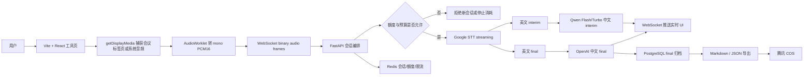
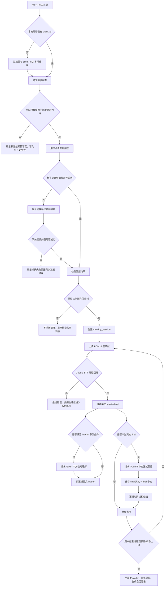
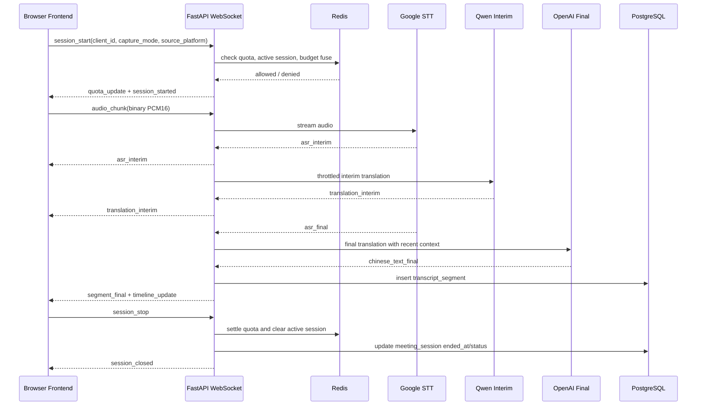
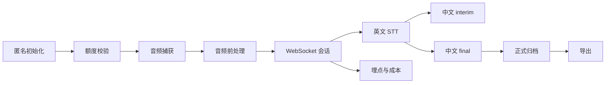

# 需求背景

## 背景

### 用户场景

许多中国职场工作者需要参加英语线上会议，但在真实会议中，发言速度、口音、专业术语、多人轮流发言和上下文跳转都会显著增加理解成本。用户需要一个打开网页即可使用的效率工具，在不安装插件或桌面客户端的前提下，帮助他们实时理解英语会议，并在会后获得可追溯的双语会议记录。

### 产品定位

Meeting MVP 是一个免登录网页工具。用户打开工具网页，授权捕获正在进行的网页会议音频，系统实时生成英文转写、中文临时理解、中文正式翻译、重点句和会议时间线，并在会后生成完整双语归档。

第一版以高质量体验优先，允许承担一定 API 成本。核心目标不是做泛用字幕工具，而是先把英语会议场景做准，让中国职场用户能快速读懂会议内容。

## 现状或问题

### 用户理解成本高

英语会议中，用户常见问题包括：

- 听不清发言者的完整英文句子。
- 能听到词，但无法快速理解业务含义。
- 会议节奏快，来不及边听边记录。
- 会后缺少完整、可追溯的双语记录。
- 会议平台自带字幕或翻译能力受账号、平台、语言和会议设置限制。

### 现有工具不完全匹配

竞品和会议平台通常能覆盖部分需求，但第一版产品需要解决以下差距：

- 平台内置字幕不一定支持高质量英中翻译。
- 会议记录工具更偏总结和自动纪要，未必保留逐段原文和翻译对应关系。
- 浏览器插件和桌面客户端安装门槛高，不适合作为第一版验证路径。
- 免登录使用和成本控制需要产品内建配额、预算保险丝和埋点。

## 需求价值

### 对用户的价值

- 实时降低英语会议理解成本。
- 将英文原文和中文职场表达并排呈现，降低误解。
- 会后可搜索、复制、导出完整双语记录。
- 在不登录、不安装插件的情况下完成第一版核心体验。

### 对产品验证的价值

- 验证“英语会议实时理解 + 中文归档”是否成立。
- 通过配额、成本和埋点验证 API 成本结构。
- 为后续登录、付费、插件、桌面客户端或团队版能力提供基础数据。

## 目的

### 第一版目标

构建一个可供 10 到 50 名测试用户使用的网页工具，满足以下目标：

- 支持 Windows Chrome / Edge。
- 重点支持 Google Meet、Microsoft Teams Web、Zoom Web、腾讯会议网页版。
- 支持标签页音频捕获，失败时支持系统音频降级。
- 实时输出英文 interim、英文 final、中文 interim、中文 final。
- 使用四区 UI 呈现英文原文、中文翻译、当前重点句和会议时间线。
- 会后生成以原文归档为主的双语会议档案。
- 对匿名用户执行每日 40 分钟、单场 30 分钟的免费额度限制。
- 支持 Markdown / JSON 导出。
- 记录基础使用、成本、延迟和错误事件。

# 整体设计思路

## 产品与技术总览

第一版采用静态前端 + FastAPI 后端 + PostgreSQL + Redis + Caddy 的单机部署架构。云服务器只做编排、存储、配额、Provider 调用和 UI 推送，不自建重型 ASR。

## 实时会议主流程

## WebSocket 时序

## 分层设计

### 前端层

前端负责音频捕获、浏览器音频前处理、实时状态展示、会后归档查询和导出入口。第一版使用 Vite + React + TypeScript，静态产物由 Caddy 服务。

### 后端编排层

后端负责 WebSocket 会话、额度、限流、Provider 调用、归档、导出、埋点和错误处理。后端不做重型 ASR 推理。

### Provider 层

Provider 层保持轻量接口：

- Google STT 主用，输出英文 interim/final。
- OpenAI STT 保留备用/对比接口。
- Qwen 负责中文 interim。
- OpenAI 文本模型负责中文 final。

### 数据层

PostgreSQL 保存正式记录，Redis 保存短期状态，腾讯 COS 保存导出文件。第一版默认不存原始会议音频。

# 名词解释

| 名词 | 定义 |
|---|---|
| Meeting MVP | 本项目第一版会议实时理解工具。 |
| 匿名用户 | 未登录用户，通过浏览器本地 `client_id` 加服务端 IP hash、User-Agent hash 做弱识别。 |
| `client_id` | 前端首次访问生成并本地保存的匿名用户标识。 |
| 会议标签页音频 | 浏览器通过 `getDisplayMedia` 捕获指定会议网页标签页时附带的音频。 |
| 系统音频 | 浏览器捕获整个屏幕或系统声音时获得的音频，可能包含非会议声音。 |
| interim | 临时结果，可替换，不进入正式档案。 |
| final | 稳定确认结果，追加进入正式档案。 |
| 英文 interim | Google STT 实时返回的临时英文转写。 |
| 英文 final | Google STT 返回的稳定英文转写片段。 |
| 中文 interim | Qwen 基于英文 interim 生成的临时中文理解。 |
| 中文 final | OpenAI 基于英文 final 和上下文生成的正式中文翻译。 |
| AudioWorklet | 浏览器 Web Audio API 的音频处理机制，用于将捕获音频转为 mono PCM16。 |
| mono PCM16 | 单声道 16-bit PCM 音频帧，适合流式 STT 识别。 |
| WebSocket binary frame | WebSocket 的二进制消息，用于上传 PCM16 音频帧。 |
| Provider | 外部能力适配器，例如 Google STT、Qwen、OpenAI、腾讯 COS。 |
| 预算保险丝 | 当全站月度预估成本超过阈值时，系统拒绝新会话以控制成本。 |
| 原文归档型纪要 | 以逐段英文原文和中文翻译对应关系为核心的会后记录，而不是仅保留摘要。 |
| 会议时间线 | 按时间顺序展示 final 片段、重点句和导出节点的记录线。 |

# 字段说明

## 数据表字段

### `anonymous_client`

| 字段 | 类型建议 | 必填 | 定义 |
|---|---:|---:|---|
| `client_id` | string/uuid | 是 | 匿名用户唯一标识，由前端首次访问生成，服务端保存并用于额度统计。 |
| `first_seen_at` | timestamptz | 是 | 首次访问时间。 |
| `last_seen_at` | timestamptz | 是 | 最近访问或活跃时间。 |
| `daily_minutes_used` | numeric/int | 是 | 当前自然日已消耗分钟数，可由事件聚合，也可缓存冗余。 |
| `created_ip_hash` | string | 是 | 首次访问 IP 的 hash，不保存明文 IP。 |
| `user_agent_hash` | string | 是 | User-Agent 的 hash，用于辅助匿名识别和防普通滥用。 |

### `meeting_session`

| 字段 | 类型建议 | 必填 | 定义 |
|---|---:|---:|---|
| `id` | string/uuid | 是 | 会议会话唯一标识。 |
| `client_id` | string/uuid | 是 | 所属匿名用户。 |
| `title` | string | 否 | 会议标题，默认可由时间和平台生成，用户后续可编辑。 |
| `source_platform` | enum/string | 是 | 会议来源平台，取值建议：`google_meet`、`teams_web`、`zoom_web`、`tencent_meeting_web`、`unknown`。 |
| `capture_mode` | enum/string | 是 | 捕获模式，取值：`tab_audio`、`system_audio`。 |
| `started_at` | timestamptz | 是 | 会话正式开始时间，应在检测到有效音频并创建后端会话后记录。 |
| `ended_at` | timestamptz | 否 | 会话结束时间。 |
| `duration_seconds` | int | 是 | 会话有效时长，按实际消耗额度的音频时长计算。 |
| `status` | enum/string | 是 | 状态，建议：`active`、`ended`、`quota_stopped`、`error`。 |
| `quota_seconds_consumed` | int | 是 | 本场会议实际消耗的免费额度秒数。 |

### `transcript_segment`

| 字段 | 类型建议 | 必填 | 定义 |
|---|---:|---:|---|
| `id` | string/uuid | 是 | 转写片段唯一标识。 |
| `session_id` | string/uuid | 是 | 所属会议会话。 |
| `sequence` | int | 是 | 片段序号，从 1 递增，用于重建会议顺序。 |
| `start_ms` | int | 是 | 片段在会议中的开始毫秒。 |
| `end_ms` | int | 是 | 片段在会议中的结束毫秒。 |
| `english_text_final` | text | 是 | 英文 final 正式转写。 |
| `chinese_text_final` | text | 是 | 中文 final 正式翻译。 |
| `speaker_label` | string | 否 | 说话人标识，第一版可为空。 |
| `is_key_sentence` | bool | 是 | 是否被系统或用户标记为重点句。 |
| `asr_confidence` | numeric | 否 | STT 置信度，Provider 提供时保存。 |
| `translation_status` | enum/string | 是 | 翻译状态，建议：`completed`、`failed`、`retrying`。 |
| `created_at` | timestamptz | 是 | 片段写入时间。 |

### `usage_event`

| 字段 | 类型建议 | 必填 | 定义 |
|---|---:|---:|---|
| `id` | string/uuid | 是 | 事件唯一标识。 |
| `client_id` | string/uuid | 是 | 匿名用户标识。 |
| `session_id` | string/uuid | 否 | 关联会议会话，非会议级事件可为空。 |
| `event_type` | enum/string | 是 | 事件类型，例如 `capture_started`、`asr_error`、`export_created`。 |
| `payload` | jsonb | 是 | 事件扩展字段，必须避免保存敏感密钥和原始音频。 |
| `created_at` | timestamptz | 是 | 事件发生时间。 |

### `export_file`

| 字段 | 类型建议 | 必填 | 定义 |
|---|---:|---:|---|
| `id` | string/uuid | 是 | 导出文件唯一标识。 |
| `session_id` | string/uuid | 是 | 所属会议会话。 |
| `format` | enum/string | 是 | 导出格式，第一版支持 `markdown`、`json`。 |
| `cos_url` | string | 是 | 腾讯 COS 文件地址或对象 key。 |
| `created_at` | timestamptz | 是 | 导出文件生成时间。 |

## WebSocket 请求字段

| 消息 | 字段 | 类型 | 必填 | 定义 |
|---|---|---:|---:|---|
| `session_start` | `client_id` | string | 是 | 匿名用户标识。 |
| `session_start` | `capture_mode` | string | 是 | `tab_audio` 或 `system_audio`。 |
| `session_start` | `source_platform` | string | 是 | 用户选择或自动推断的平台。 |
| `session_start` | `audio_format` | object | 是 | 音频格式，至少包含 sample rate、channels、encoding。 |
| `audio_chunk` | binary body | bytes | 是 | mono PCM16 音频帧。 |
| `heartbeat` | `session_id` | string | 是 | 当前会话 ID，用于保持连接和探测断连。 |
| `session_stop` | `session_id` | string | 是 | 当前会话 ID。 |

## WebSocket 响应字段

| 消息 | 字段 | 类型 | 必填 | 定义 |
|---|---|---:|---:|---|
| `quota_update` | `remaining_seconds_today` | int | 是 | 今日剩余额度秒数。 |
| `audio_status` | `has_audio` | bool | 是 | 是否检测到有效音频输入。 |
| `audio_status` | `level` | number | 否 | 音量电平，用于前端显示。 |
| `asr_interim` | `text` | string | 是 | 英文临时转写文本。 |
| `translation_interim` | `text` | string | 是 | 中文临时理解文本。 |
| `segment_final` | `segment_id` | string | 是 | 已归档片段 ID。 |
| `segment_final` | `sequence` | int | 是 | 片段序号。 |
| `segment_final` | `start_ms` | int | 是 | 片段开始毫秒。 |
| `segment_final` | `end_ms` | int | 是 | 片段结束毫秒。 |
| `segment_final` | `english_text_final` | string | 是 | 英文正式转写。 |
| `segment_final` | `chinese_text_final` | string | 是 | 中文正式翻译。 |
| `key_sentence_update` | `text` | string | 是 | 当前重点句内容。 |
| `timeline_update` | `items` | array | 是 | 会议时间线节点列表。 |
| `warning` | `code` | string | 是 | 可恢复问题编码。 |
| `error` | `code` | string | 是 | 不可忽略错误编码。 |
| `session_closed` | `reason` | string | 是 | 会话关闭原因，例如 `user_stop`、`quota_limit`、`provider_error`。 |

# 功能清单

| 序号 | 功能板块 | 功能解释 | 优先级 | 备注 |
|---:|---|---|---|---|
| 1 | 匿名用户初始化 | 首次访问生成 `client_id`，建立匿名额度身份。 | M1 | 不做登录。 |
| 2 | 额度与预算校验 | 检查每日 40 分钟、单场 30 分钟、并发 1 场和全站预算保险丝。 | M1 | Redis 承担实时状态。 |
| 3 | 会议音频捕获 | 通过 `getDisplayMedia` 捕获会议标签页音频，失败时支持系统音频。 | M1 | 重点验证腾讯会议网页版。 |
| 4 | 音频前处理 | 使用 AudioWorklet 转 mono PCM16 并通过 WebSocket binary frame 上传。 | M1 | 不以 FFmpeg 为主路径。 |
| 5 | WebSocket 会话编排 | 建立、维持、关闭实时会议会话。 | M1 | FastAPI 实现。 |
| 6 | 英文实时转写 | Google STT streaming 输出英文 interim/final。 | M1 | 生产主路径。 |
| 7 | 中文 interim | Qwen Flash/Turbo 生成临时中文理解。 | M1 | 节流触发，不归档。 |
| 8 | 中文 final | OpenAI 文本模型生成正式中文翻译。 | M1 | 归档。 |
| 9 | 四区实时 UI | 英文原文、中文翻译、当前重点句、会议时间线。 | M1 | 第一屏即工作台。 |
| 10 | 会后双语归档 | 按 final 片段生成完整可追溯记录。 | M2 | 原文归档型。 |
| 11 | 搜索与复制 | 对会后记录进行检索和复制。 | M2 | 面向复盘。 |
| 12 | Markdown / JSON 导出 | 生成导出文件并写入腾讯 COS。 | M2 | Word 后续扩展。 |
| 13 | final 翻译重试 | OpenAI final 翻译失败后允许重试或后台补译。 | M2 | 保证档案完整性。 |
| 14 | 使用量与成本看板 | 展示分钟数、token、费用估算、错误和延迟。 | M3 | 轻量看板。 |
| 15 | Provider 开关 | 管理 Google STT、OpenAI STT、Qwen、OpenAI 翻译状态。 | M3 | 支持备用/对比。 |
| 16 | 异常与降级提示 | 捕获失败、无音频、额度不足、Provider 错误时给出可执行提示。 | M1 | 必须面向普通用户可理解。 |

# 功能描述

## 功能流程总览

## 匿名用户初始化

### 条件

当用户首次打开工具页，且浏览器本地不存在 `client_id`。

### 动作

前端生成新的 `client_id` 并保存到浏览器本地；后端在用户第一次请求额度状态时创建或更新 `anonymous_client` 记录，并保存 IP hash 与 User-Agent hash。

### 预期

用户无需登录即可进入工具页；服务端能基于 `client_id` 统计每日额度。若本地存储不可用，前端提示用户启用浏览器存储，否则无法保证免费额度统计。

## 额度校验

### 条件

当用户点击开始会议，且已经存在 `client_id`。

### 动作

后端检查：

- 今日剩余额度是否大于 0。
- 当前匿名用户是否已有活跃会议。
- 单场会议是否可新建。
- 全站月度预算保险丝是否触发。

### 预期

若检查通过，后端允许创建实时会话。若每日额度用完，返回 `quota_update` 和 `warning`，前端展示“今日免费额度已用完”。若预算保险丝触发，前端展示“当前测试额度已暂停新会议，已有记录仍可查看和导出”。

## 会议音频捕获

### 条件

当用户点击“开始捕获会议音频”，并使用 Windows Chrome / Edge。

### 动作

前端调用 `getDisplayMedia`，引导用户优先选择会议所在标签页并勾选共享音频。若标签页音频捕获失败或没有音频电平，则引导用户切换为整个屏幕/系统音频捕获。

### 预期

系统能捕获 Google Meet、Teams Web、Zoom Web、腾讯会议网页版的远端讲话者音频。若用户拒绝授权，前端不创建正式会话，不消耗额度，并展示重新授权入口。

## 音频前处理与上传

### 条件

当浏览器捕获到有效音频流，且 WebSocket 会话已建立。

### 动作

前端通过 AudioContext 和 AudioWorklet 将音频转换为 mono PCM16 音频帧，并通过 WebSocket binary frame 持续上传。

### 预期

后端收到稳定 PCM16 音频帧并转发给 Google STT。若音频电平持续为 0，前端展示“未检测到会议声音”，后端不应继续消耗会议额度。

## Google STT 英文转写

### 条件

当后端收到有效 PCM16 音频帧，且 Google STT provider 可用。

### 动作

后端将音频帧写入 Google STT streaming session，接收英文 interim 和英文 final 事件，并通过 WebSocket 推送给前端。

### 预期

用户讲话期间能看到英文 interim；英文 final 出现后进入正式片段处理。若 Google STT 异常，后端推送 `error`，关闭或暂停会话，并记录 `usage_event`。第一版可保留 OpenAI STT 作为实验入口，不要求自动无缝切换。

## Qwen 中文 interim

### 条件

当英文 interim 文本变化达到阈值，且距离上次 interim 翻译请求超过节流时间。

### 动作

后端调用阿里云百炼 Qwen Flash/Turbo，生成简洁中文临时理解，并通过 `translation_interim` 推送前端。

### 预期

中文 interim 能帮助用户快速理解当前讲话大意，但样式必须标记为临时状态。若 Qwen 请求失败，前端保留英文 interim，中文区域显示“临时理解生成中”或保持上一次结果，不影响英文转写和中文 final。

## OpenAI 中文 final

### 条件

当 Google STT 返回英文 final segment。

### 动作

后端携带当前英文 final 和最近 3 到 5 个 final segment 上下文，请求 OpenAI 文本模型生成正式中文翻译。翻译结果与英文 final 一起写入 `transcript_segment`。

### 预期

中文 final 表达自然、语义准确、适合中国职场阅读。若 OpenAI 请求失败，片段标记为 `translation_status=failed`，前端展示待重试状态，后续可由 M2 重试机制补齐。

## 四区实时 UI

### 条件

当前端收到 `asr_interim`、`translation_interim`、`segment_final`、`key_sentence_update` 或 `timeline_update`。

### 动作

前端按消息类型更新四个区域：

- 英文原文区展示英文 interim 和 final。
- 中文翻译区展示中文 interim 和 final。
- 当前重点句区展示当前重要句或最新 final 重点。
- 会议时间线区追加 final 片段和关键事件。

### 预期

interim 内容可替换，final 内容只追加。任何区域更新失败不应阻塞其他区域。正式档案只基于 final 片段重建。

## 会议时间线

### 条件

当产生新的 final segment、重点句或导出事件。

### 动作

后端生成或更新 timeline item，并通过 `timeline_update` 推送给前端。

### 预期

用户能按时间顺序回看会议内容。时间线节点应至少包含时间点、类型、摘要文本和关联 segment ID。

## 会后归档

### 条件

当用户主动结束会议、额度到达上限、Provider 错误导致会话关闭，或 WebSocket 断开并超过恢复窗口。

### 动作

后端关闭 Provider session，结算额度，更新 `meeting_session` 状态，保留已完成的 final 片段。

### 预期

用户能进入会后记录页查看已生成的双语 final 片段。若会议异常结束，记录页必须保留已归档内容，并标明结束原因。

## Markdown / JSON 导出

### 条件

当会议存在至少一个 `transcript_segment`，且用户点击导出。

### 动作

后端按时间顺序读取 final 片段，生成 Markdown 或 JSON 文件，上传腾讯 COS，并写入 `export_file`。

### 预期

用户能获得可下载导出文件。若 COS 上传失败，前端提示重试，后端记录 `export_failed` 事件。

## 成本统计和预算保险丝

### 条件

当发生 STT、Qwen、OpenAI、导出或会话时长相关事件。

### 动作

后端写入 `usage_event`，并更新 Redis 或数据库中的使用量与成本估算。系统定期判断月度预算是否达到阈值。

### 预期

当月度预算达到 400 RMB 建议阈值时，系统拒绝新会话，但不影响已有会议记录查看和导出。

## 异常提示与降级

### 条件

当出现捕获失败、未检测到音频、额度不足、Provider 异常、WebSocket 断开、导出失败或预算保险丝触发。

### 动作

后端发送 `warning` 或 `error`，前端展示用户能理解的原因和下一步操作，例如切换系统音频、检查共享音频、稍后重试或查看已归档内容。

### 预期

异常不应造成用户已归档内容丢失。可恢复异常用 `warning`，不可继续的异常用 `error` 和 `session_closed`。

# 功能边界

## 第一版范围内

- 免登录匿名使用。
- 网页会议音频捕获。
- 英语会议实时转写。
- 中文 interim 和中文 final。
- 四区实时阅读 UI。
- 原文归档型会后记录。
- Markdown / JSON 导出。
- 基础额度、成本、埋点和预算保险丝。
- 单机 Docker Compose 部署。

## 第一版范围外

- 用户登录与账号体系。
- 跨设备云端历史同步。
- 浏览器插件。
- 桌面客户端。
- 虚拟音频设备。
- 本地自建 Whisper 生产服务。
- 多语言会议优化。
- 自动生成复杂管理纪要、责任人识别和任务分派。
- Word 导出，第一版后续扩展。

## 平台边界

第一版重点支持 Windows Chrome / Edge。Google Meet、Teams Web、Zoom Web、腾讯会议网页版必须测试。腾讯会议网页版标签页音频如果不可用，允许使用系统音频降级。

## 数据边界

第一版默认不保存原始会议音频，不保存明文 IP，不把中文 interim 作为正式档案。正式归档仅保存英文 final、中文 final、时间戳、序号、状态和导出文件信息。

# 非功能性要求

## 性能与实时性

- 英文 interim 应在音频输入后尽快出现，前端应优先显示英文 interim。
- 中文 interim 需节流，避免请求过密导致成本和 UI 抖动。
- 中文 final 可晚于英文 final 出现，但必须保持片段顺序。
- 四区 UI 更新互不阻塞。

## 稳定性

- WebSocket 断开时应关闭或回收 Provider session。
- Provider 失败不应丢失已归档 final 片段。
- Redis active session 必须设置过期时间，避免异常断开后永久占用并发。
- 会话关闭应执行额度结算。

## 安全与隐私

- 生产环境必须使用 HTTPS/WSS。
- API keys 只能通过后端环境变量注入，前端不得暴露 Provider 密钥。
- 不保存原始会议音频。
- IP 和 User-Agent 只保存 hash。
- 导出文件地址应具备可控访问策略。

## 成本控制

- 匿名用户每日 40 分钟。
- 单场会议最多 30 分钟。
- 同一匿名用户最多 1 个活跃会议。
- 全站月度预算保险丝初始阈值建议 400 RMB。
- 记录 Google STT 分钟数、Qwen token、OpenAI token、导出次数和失败重试次数。

## 可维护性

- Provider 抽象保持轻量。
- 前端使用 Vite 静态构建。
- 后端使用 FastAPI、Pydantic、SQLAlchemy async 和 Alembic。
- 配置统一由环境变量管理。
- 业务逻辑、Provider 调用、数据访问和 WebSocket 消息 schema 分层。

## 兼容性

- 第一版主测 Windows Chrome / Edge。
- 不承诺 Safari、Firefox、移动端浏览器。
- 系统音频模式需要明确风险提示。

# 上线方案

## 环境准备

### 条件

腾讯云 Lighthouse 已准备 Ubuntu 22.04 LTS 64 位 x86 服务器，并可安装 Docker。

### 动作

部署 Docker、Docker Compose、Caddy、PostgreSQL、Redis、后端容器和前端静态产物。配置 Google STT、阿里云百炼、OpenAI、腾讯 COS、PostgreSQL、Redis 的环境变量。

### 预期

服务可通过 HTTPS 域名访问，WebSocket 使用 WSS，健康检查通过。

## 发布阶段

### 内部验证

- 使用本地 mock Provider 验证 UI 和 WebSocket 协议。
- 使用真实 Google STT 验证英文 interim/final。
- 使用真实 Qwen 验证中文 interim。
- 使用真实 OpenAI 验证中文 final。
- 使用腾讯 COS 验证 Markdown / JSON 导出。

### 小范围测试

- 先开放给 10 到 50 名测试用户。
- 每人每日 40 分钟。
- 监控 API 成本、失败率、延迟、捕获失败原因和腾讯会议兼容性。

### 回滚策略

- 前端静态产物保留上一版本。
- 后端容器保留上一镜像 tag。
- 数据库 migration 上线前必须备份。
- Provider 配置支持关闭 Qwen interim 或拒绝新会议。

## 上线检查

- HTTPS/WSS 可用。
- Caddy 正确服务静态前端并代理 `/api/*`、`/ws/*`。
- PostgreSQL migration 已执行。
- Redis 可连接。
- Provider credentials 已配置。
- 预算保险丝默认启用。
- 使用量和错误事件可写入。

# 验收标准

## 核心链路验收

- Windows Chrome / Edge 可以捕获 Google Meet、Teams Web、Zoom Web、腾讯会议网页版音频。
- 腾讯会议网页版支持标签页音频优先，失败时可降级系统音频。
- 用户开始会议后能看到英文 interim。
- 英文 final 产生后能触发中文 final 并归档。
- 中文 interim 能以受控频率出现，并标记为临时理解。
- 四区 UI 能独立更新。
- 会后归档能按时间顺序显示双语 final 片段。
- Markdown / JSON 导出成功写入腾讯 COS。

## 额度与成本验收

- 每个匿名用户每天最多消耗 40 分钟。
- 单场会议最多 30 分钟。
- 同一匿名用户不能同时开启多场会议。
- 全站预算保险丝触发后，新会议被拒绝，已有记录仍可查看。

## 异常验收

- 用户拒绝捕获授权时，不消耗额度并显示重试入口。
- 无音频输入时，不消耗额度并提示检查共享音频。
- Qwen 失败时，不阻塞英文转写和中文 final。
- OpenAI final 失败时，片段进入待重试状态。
- WebSocket 断开时，会话能被清理并保留已归档内容。

# 埋点与数据看板

## 事件清单

| 事件类型 | 触发时机 | 关键 payload |
|---|---|---|
| `client_created` | 新匿名用户创建 | `client_id`、UA hash、IP hash |
| `quota_checked` | 用户请求额度 | 剩余额度、是否允许 |
| `capture_started` | 用户开始捕获 | capture mode、platform |
| `capture_failed` | 捕获失败 | error code、browser |
| `audio_detected` | 检测到有效音频 | level、capture mode |
| `session_started` | 后端会话创建 | session_id、quota remaining |
| `asr_interim_received` | 收到英文 interim | text length、latency |
| `asr_final_received` | 收到英文 final | duration、confidence |
| `translation_interim_requested` | 请求 Qwen | token estimate、throttle reason |
| `translation_final_completed` | OpenAI final 完成 | token usage、latency |
| `segment_archived` | final 片段入库 | sequence、duration |
| `export_created` | 导出完成 | format、file size |
| `provider_error` | Provider 失败 | provider、code、recoverable |
| `quota_exhausted` | 用户额度耗尽 | consumed seconds |
| `budget_fuse_triggered` | 全站预算触发 | estimated monthly cost |
| `session_closed` | 会话关闭 | reason、duration |

## 看板指标

- 日活匿名用户数。
- 每日会议数。
- 每日 STT 分钟数。
- Qwen 请求量和 token。
- OpenAI 请求量和 token。
- 预估日成本和月成本。
- 捕获失败率。
- Provider 错误率。
- 平均英文 interim 延迟。
- 平均中文 final 延迟。
- 腾讯会议网页版成功率。

# 风险与依赖

## 关键依赖

- Google Cloud Speech-to-Text v2 streaming。
- 阿里云百炼 Qwen Flash/Turbo。
- OpenAI 文本模型。
- 腾讯 COS。
- Windows Chrome / Edge 的音频捕获能力。
- 腾讯会议网页版对浏览器音频捕获的兼容性。

## 主要风险

| 风险 | 影响 | 应对 |
|---|---|---|
| 腾讯会议标签页音频无法稳定捕获 | 影响重点平台体验 | 提供系统音频降级，并单独记录兼容性指标。 |
| API 成本超预算 | 影响测试持续性 | 每日额度、单场限制、预算保险丝、成本看板。 |
| Qwen interim 质量不稳定 | 影响实时理解 | 明确标记临时状态，失败不阻塞主链路。 |
| OpenAI final 延迟较高 | 影响正式中文出现速度 | UI 先展示英文 final 和中文生成中，完成后补齐。 |
| WebSocket 断开 | 可能中断会议 | 清理资源，保留已归档内容，显示结束原因。 |
| 无登录额度被绕过 | 成本风险 | 第一版防普通滥用，规模扩大后加邀请码或登录。 |

# 其他必要说明

## AI 开发者实施原则

- 先完成 M1 核心闭环，再做 M2 导出和 M3 看板。
- 所有 Provider 调用必须经过后端，前端不得出现密钥。
- 所有正式归档以 final 片段为准，不用 interim 重建正式记录。
- WebSocket message schema 必须可测试，前后端共享或镜像定义。
- 所有异常都要产生用户可理解的提示和开发者可排查的 `usage_event`。

## PRD 结构评价

本 PRD 结构清晰，达到成熟且专业的 PRD 基础要求。它覆盖了背景、价值、目标、整体设计、名词、字段、功能清单、详细功能逻辑、边界、非功能、上线、验收、埋点和风险。面向 AI 开发者时，字段说明、WebSocket 消息、异常流和验收标准是必要补充，可以降低实现歧义。
